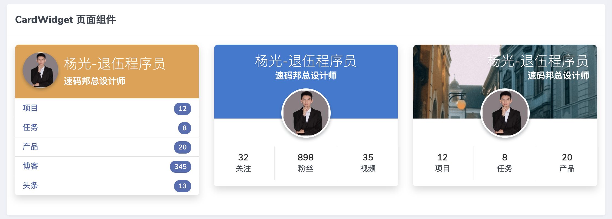
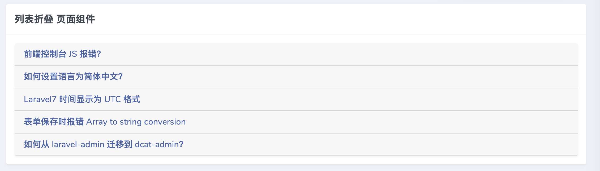
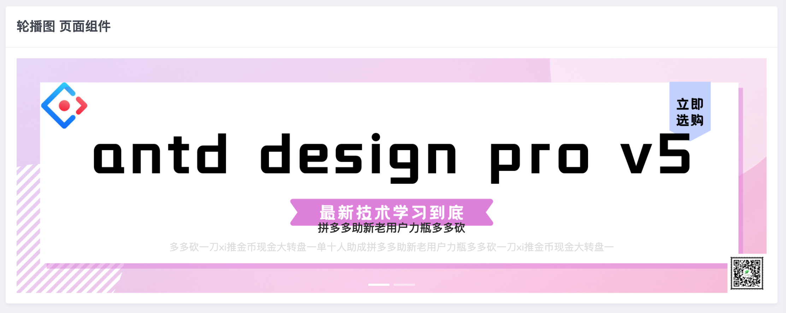
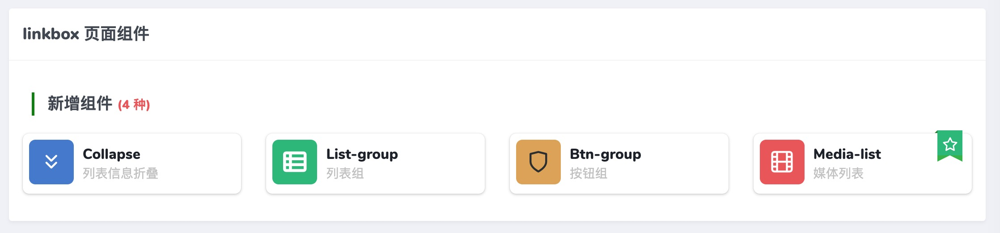
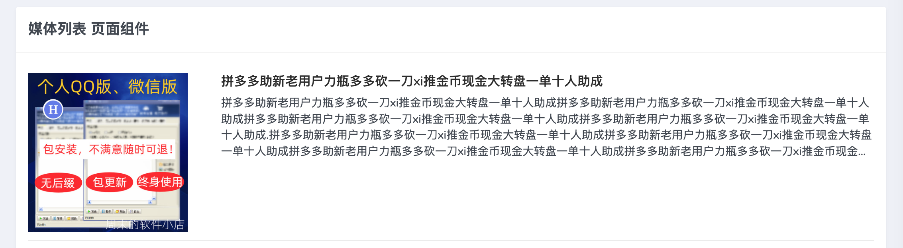
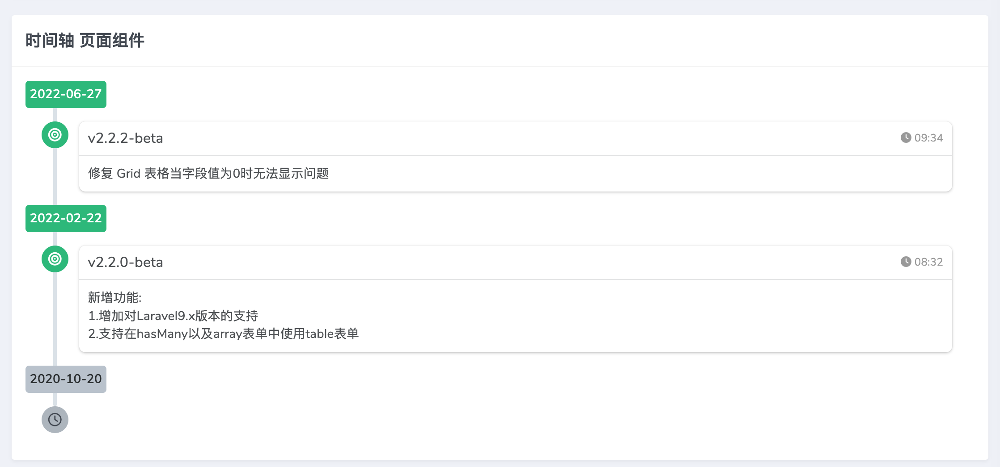
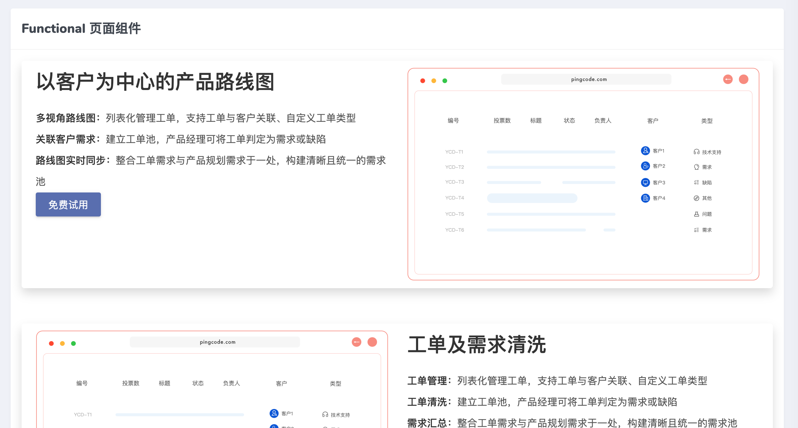

# 让 Dcat-admin 再放光芒系列 页面组件库 扩展包

## 开发 multi-widgets(页面组件库) 的初衷
!> `Dcat-admin` 原来的页面组件，对于构建更复杂多样的页面，还是远远不够用。在这样的情况下，只能自己动手写blade 模板去使用。
   为了解决这个问题，提升 `Dcat-admin`  的适用性，`multi-widgets`诞生了。日后会把网络上更多的页面组件集成进来。让后端开发，轻松就能搞出漂亮的页面。

## 下载安装扩展包
- [github库](https://github.com/ycookies/multi-widgets)
- [码云git库](https://gitee.com/ycookies/multi-widgets)
- composer 安装

```bash
composer require ycookies/multi-widgets
```

## 新增10个常用页面组件
```php
         return $content
             ->title('页面组件示例演示')
             ->description('直观感受 快速使用')
             ->row(Card::make('CardWidget 页面组件', $this->cardWidget())->withHeaderBorder())
             ->row(Card::make('CoverCard 页面组件', $this->coverCard())->withHeaderBorder())
             ->row(Card::make('列表折叠 页面组件', $this->collapse())->withHeaderBorder())
             ->row(Card::make('轮播图 页面组件', $this->carousel())->withHeaderBorder())
             ->row(Card::make('linkbox 页面组件', $this->linkBox())->withHeaderBorder())
             ->row(Card::make('媒体列表 页面组件', $this->mediaList())->withHeaderBorder())
             ->row(Card::make('订价卡 页面组件', $this->pricingCard())->withHeaderBorder())
             ->row(Card::make('时间轴 页面组件', $this->timeline())->withHeaderBorder())
             ->row(Card::make('Functional 页面组件', $this->functional())->withHeaderBorder())
             ->row(Card::make('Remark 页面组件', $this->wei_popover())->withHeaderBorder());
```
## 使用说明
#### CardWidget 页面组件
!> 三种风格可选 从左到右( 1,2,3)


  ```php
  $user_widget = CardWidget::make()->boxStyle(1); // 风格1
  $user_widget = CardWidget::make()->boxStyle(2); // 风格2
  $user_widget = CardWidget::make()->boxStyle(3); // 风格3
  
   $navItem1 = [
              [
                  'name' => '关注',
                  'num'=> 32,
              ],
              [
                  'name' => '粉丝',
                  'num'=> 898,
              ],
              [
                  'name' => '视频',
                  'num'=> 35,
              ],
          ];
          $user_widget1 = CardWidget::make()->boxStyle(2); // 指定风格
          $user_widget1->add('标题','头像','子标题')
                       ->navItem($navItem1) // 列表数据
                       ->shadow('shadow'); // 阴影特效 (shadow-none 阴影 ,shadow-sm 小阴影,shadow 常规阴影,shadow-lg 大阴影)
  ```
#### CoverCard 页面组件


```php
$cover_card = CoverCard::make()->add('标题', '子标题')
            ->bg('背景图')
            ->avatar('主图');
            ->shadow('shadow-none') // 阴影特效 (shadow-none 阴影 ,shadow-sm 小阴影,shadow 常规阴影,shadow-lg 大阴影)
```
#### 列表折叠 页面组件

```php
$collapse = Collapse::make();
        $collapse->add('标题', "内容");
        $collapse->add('标题', '内容');
```
#### 轮播图 页面组件

```php
$carousel = Carousel::make();
$datalist   = [
    [
        'img_src' => '图片url址',
        'title'     => '标题',
        'content'   => '内容',
        'link'      => '点击后跳转链接',
    ],
    [
        'img_src' => 'https://rails365.oss-cn-shenzhen.aliyuncs.com/uploads/slide/image/4/2021/007596a025ecf51207c13eda90d04508.png',
        'title'     => '自动发货养号秒发秒评手机图片可爱萌萌哒壁纸',
        'content'   => '可爱萌萌哒壁纸一分钱壁纸0.01元自动发货养号秒发秒评手机图片',
        'link'      => 'https://www.taobao.com',
    ]
];
foreach ($datalist as $key => $items) {
    $carousel->add($items['img_src'],$items['title'], $items['content'], $items['link']);
}

return $carousel->render();
```
#### linkbox 页面组件

```php
$link_group = [
            [
                'icon'      => '图标',
                'title'     => '标题',
                'sub_title' => '子标题',
                'link'      => '跳转链接',
                'bg_value'  => '背景色',
                'hot'       => false,// 是否热门
            ], [
                'icon'      => 'fa fa-fw fa-th-list',
                'title'     => 'List-group',
                'sub_title' => '列表组',
                'link'      => '#',
                'bg_value'  => 'bg-success',
                'hot'       => false,
            ]
        ];

        $linkbox = new Linkbox();
        // 分组标题
        $linkbox->groupTitle('新增组件 <span class="text-danger f14">('.count($link_group).' 种)</span>');
        //$linkbox->target('_blank');

        foreach ($link_group as $key => $itemk) {
            $linkbox->add($itemk['icon'], $itemk['title'], $itemk['sub_title'], $itemk['link'], $itemk['bg_value'])->hot($itemk['hot']);
        }

        return $linkbox->render();
```
#### 媒体列表 页面组件

```php
$media_list = MediaList::make()
                ->imgCenter(true) // 图片水平垂直居中 
                ->imgMaxWidth('200px')// 图片最大尺寸
                ->rowNum(4); // 限制展示行数
        $datalist   = [
            [
                'title'     => '标题',
                'content'   => '简介',
                'media_img' => '图片url',
                'link'      => '链接地址',
            ],
            [
                'title'     => '一分钱壁纸0.01元自动发货养号秒发秒评手机图片可爱萌萌哒壁纸',
                'content' => '一分钱壁纸0.01元自动发货养号秒发秒评手',
                'media_img' => 'https://g-search1.alicdn.com/img/bao/uploaded/i4/i1/2217906880198/O1CN01SLfRkR1DKjOBs05sx_!!2217906880198.jpg_460x460q90.jpg',
                'link'      => '',
            ]
        ];
        foreach ($datalist as $key => $items) {
            $media_list->add($items['title'], $items['content'], $items['media_img'], $items['link']);
        }

        return $media_list->render();
```
#### 订价卡 页面组件

```php
$pricing_card  = PricingCard::make()
                    ->columns(3)// 展示列数，3列
                    ->isCenter();// 文字居中
       $urls = 'https://xxxxx.xxxxx.net/api/aigc_tools/getVerPayQrcode?pay_url_qrcode=' . urlencode($paysurlqrcode);
$pricing_card->btnClick($urls); // 点击事件 获取支付二维码

$pricing_card->add('会员版', 89) // 卡标题，价格
            ->li(['常用功能-12' => true, '常用功能-13' => true, '常用功能-14' => false, '常用功能-15' => false, '常用功能-16' => false])
            ->head('10人坐席') // 列表头部提示
            ->footer("<span class='text-danger'>超级优惠，快速订阅</span>") // 底部提示语
            ->active() // 默认选中
            ->btnTxt('订购 (超优惠)'); // 按钮展示文案
return $pricing_card->render();
                    
```
#### 时间轴 页面组件

```php
$datalist = [
            [
                'title'    => '标题', 
                'content'  => '内容',
                'time'     => '几点钟',
                'date_label' => '日期',
            ],
            [
                'title'   => 'v2.2.0-beta',
                'content' => "新增功能: <br/>1.增加对Laravel9.x版本的支持 <br/>2.支持在hasMany以及array表单中使用table表单",
                'time'     => '08:32',
                'date_label' => '2022-02-22',
            ]
        ];
        $timeline = Timeline::make()
        ->startDate('2022-09-27') // 开启时间
        ->endDate('2020-10-20'); //  结束时间
        foreach ($datalist as $key => $items) {
            $timeline->add( $items['title'], $items['content'],$items['time'],$items['date_label']);
        }
        return $timeline->render();
```
#### Functional 页面组件

```php
$functional = Functional::make()->boxcolor();
$functional->add('标题', '内容', '主图')
            ->bgcolor('#ffffff') // 背景色
            ->round() // 是否圆角
            ->shadow() // 阴影特效 (shadow-none 阴影 ,shadow-sm 小阴影,shadow 常规阴影,shadow-lg 大阴影)
            ->btn('免费试用', 'https://jikeadmin.saishiyun.net/admin');
```

#### Remark 页面组件

```php
$popover = Remark::make('这是一个提示','标题')
->placement('right') // 展示方向 默认 right  可选有(top,right,left,bottom)
->icon('feather icon-help-circle'); // 图标 默认 feather icon-help-circle  可选 dcat-admin 自带图标
return $popover->render();
```
## 作者展示


## 作者更多的 Dcat-admin 的开源

- 多应用生成器
- 水平垂直菜单
- 公众号文章采集器
- 接口文档
- 知识库文档

## 帮助赞助作者，让其它产生更多优质开源作品


